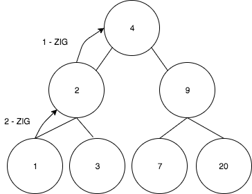
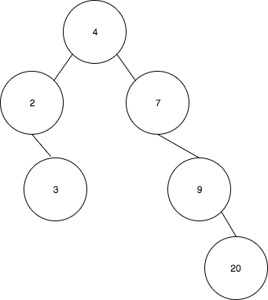
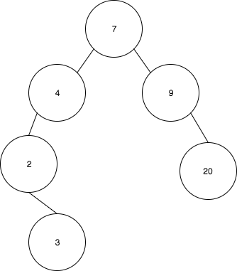

# Splay Tree
Splay tree is a data structure, structurally identitical to a Balanced Binary Search Tree. Every operation performed on a Splay Tree causes a readjustment in order to provide fast access to recently operated values. On every access, the tree is rearranged and the node accessed is moved to the root of the tree using a set of specific rotations, which together are referred to as **Splaying**.


## Rotations

There are 3 types of rotations that can form an **Splaying**:

- ZigZig
- ZigZag
- Zig

### Zig-Zig

Given a node *a* if *a* is not the root, and *a* has a child *b*, and both *a* and *b* are left children or right children, a **Zig-Zig** is performed.

### Case both nodes right children


### Case both nodes left children


**IMPORTANT** is to note that a *ZigZig* performs first the rotation of the middle node with its parent (call it the grandparent) and later the rotation of the remaining node (grandchild). Doing that helps to keep the trees balanced even if it was first created by inserted a sequence of increasing values (see below worst case scenario).

### Zig-Zag

Given a node *a* if *a* is not the root, and *a* has a child *b*, and *b* is the left child of *a* being the right child (or the opporsite), a **Zig-Zag** is performed.

### Case right - left


### Case left - right


**IMPORTANT** A *ZigZag* performs first the rotation of the grandchild node and later the same node with its new parent again. 

### Zig

A **Zig** is performed when the node *a* to be rotated has the root as parent.


## Splaying

A splaying consists in making so many rotations as needed until the node affected by the operation is at the top and becomes the root of the tree.

```
while (node.parent != nil) {
            operation(forNode: node).apply(onNode: node)
}
```

Where operation returns the required rotation to be applied. 

```
    public static func operation<T: Comparable>(forNode node: Node<T>) -> SplayOperation {
        
        if let parent = node.parent, let _ = parent.parent {
            if (node.isLeftChild && parent.isRightChild) || (node.isRightChild && parent.isLeftChild) {
                return .zigZag
            }
            return .zigZig
        }
        return .zig
    }
```

During the applying phase, the algorithms determines which nodes are involved depending on the rotation to be applied and proceeding to re-arrange the node with its parent.

```
    public func apply<T: Comparable>(onNode node: Node<T>) {
        switch self {
        case .zigZag:
            assert(node.parent != nil && node.parent!.parent != nil, "Should be at least 2 nodes up in the tree")
            rotate(child: node, parent: node.parent!)
            rotate(child: node, parent: node.parent!)

        case .zigZig:
            assert(node.parent != nil && node.parent!.parent != nil, "Should be at least 2 nodes up in the tree")
            rotate(child: node.parent!, parent: node.parent!.parent!)
            rotate(child: node, parent: node.parent!)
        
        case .zig:
            assert(node.parent != nil && node.parent!.parent == nil, "There should be a parent which is the root")
            rotate(child: node, parent: node.parent!)
        }
    }
```


## Operations on an Splay Tree

### Insertion 

### Deletion 

### Search 

## Examples 

### Example 1


### Example 2






## Advantages 

Splay trees provide an efficient way to quickly access elements that are frequently requested. This characteristic makes then a good choice to implement, for exmaple, caches or garbage collection algorithms, or in any other problem involving frequent access to a certain numbers of elements from a data set.

## Disadvantages

Splay tree are not perfectly balanced always, so in case of accessing all the elements in the tree in an increasing order, the height of the tree becomes *n*.

## Time complexity

| Case        |    Performance        |
| ------------- |:-------------:|
| Average      | O(log n) |
| Worst      | n |

With *n* being the number of items in the tree.

# An example of the Worst Case Performance 


## See also

[Splay Tree on Wikipedia](https://en.wikipedia.org/wiki/Splay_tree)
[Splay Tree by University of California in Berkeley - CS 61B Lecture 34](https://www.youtube.com/watch?v=G5QIXywcJlY)

*Written for Swift Algorithm Club by Barbara Martina Rodeker*
