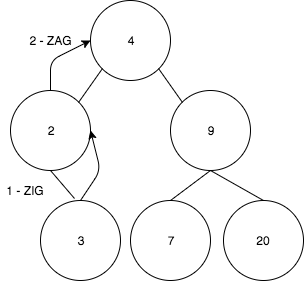
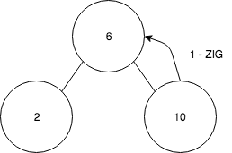
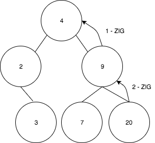
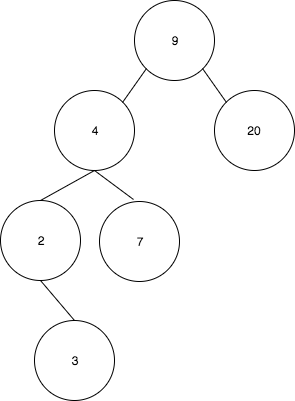
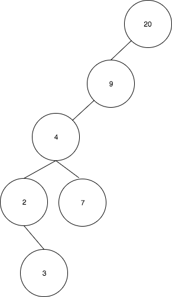
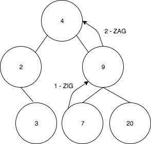

# Splay Tree
Splay tree is a data structure, structurally identitical to a Balanced Binary Search Tree. Every operation performed on a Splay Tree causes a readjustment in order to provide fast access to recently operated values. On every access, the tree is rearranged and the node accessed is moved to the root of the tree using a set of specific rotations, which together are referred to as **Splaying**.

## Rotations

### Zig-Zig

Given a node *a* if *a* is not the root, and *a* has a child *b*, and both *a* and *b* are left children or right children, a **Zig-Zig** is performed.

### Zig-Zag

Given a node *a* if *a* is not the root, and *a* has a child *b*, and *b* is the left child of *a* being the right child (or the opporsite), a **Zig-Zag** is performed.

### Zig

A **Zig** is performed when the node *a* to be rotated has the root as parent.

## Splaying

## Operations

### Insertion 

### Deletion 

### Search 

## Examples 

### Example 1

### Example 2

## Advantages 

Splay trees provide an efficient way to quickly access elements that are frequently requested. This characteristic makes then a good choice to implement, for exmaple, caches or garbage collection algorithms, or in any other problem involving frequent access to a certain numbers of elements from a data set.

## Disadvantages

Splay tree are not perfectly balanced always, so in case of accessing all the elements in the tree in an increasing order, the height of the tree becomes *n*.

## Time complexity

| Case        |    Performance        |
| ------------- |:-------------:|
| Average      | O(log n) |
| Worst      | n |

With *n* being the number of items in the tree.

## See also

[Splay Tree on Wikipedia](https://en.wikipedia.org/wiki/Splay_tree)
[Splay Tree by University of California in Berkeley - CS 61B Lecture 34](https://www.youtube.com/watch?v=G5QIXywcJlY)

*Written for Swift Algorithm Club by Barbara Martina Rodeker*
